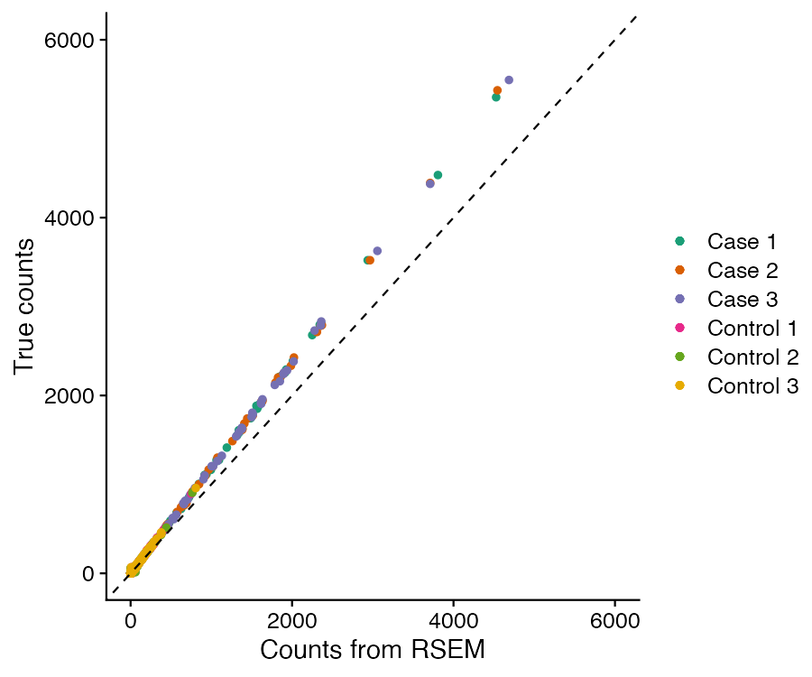
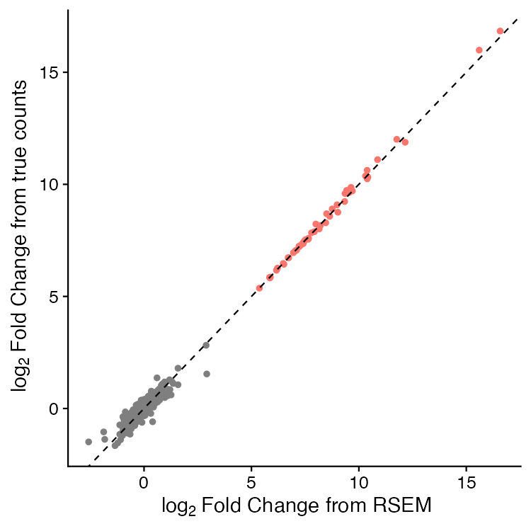

# Microbial RNA-seq 

## Summary of methods 

* Index generated with [RSEM](http://deweylab.github.io/RSEM){:target="\_blank"}
* Filter and trim reads with [fastp](https://github.com/OpenGene/fastp){:target="\_blank"}
* Quality checking of reads with [FastQC](http://www.bioinformatics.babraham.ac.uk/projects/fastqc/){:target="\_blank"}
* Reads mapped to reference and quantified with [RSEM](http://deweylab.github.io/RSEM){:target="\_blank"}
* Alignment post-processing and QC with [Picard](https://broadinstitute.github.io/picard/){:target="\_blank"}
* Aggregation of QC tables using [MultiQC](https://multiqc.info){:target="\_blank"}

## Parameters

### Required parameters:

* `--pubdir` 
	* Default: `/<PATH>` 
	* Description: The directory that the saved outputs will be stored.

* `-w`
    * Default: `/<PATH>`
    * The directory that all intermediary files and nextflow processes utilize. This directory can become quite large. This should be a location on scratch space or other directory with ample storage.

* `--sample_folder` 
    * Default: `/<PATH>`
    * The path to the folder that contains all the samples to be run by the pipeline. The files in this path can also be symbolic links.

* `--strandedness`
    * Default: `NA`
    * Supported options are `reverse_stranded`, `forward_stranded`, `non_stranded`

* `--concat_lanes`
    * Default: `false`
    * Options: `false` and `true`. Default: `false`. If this boolean is specified, FASTQ files will be concatenated by sample. Used in cases where samples are divided across individual sequencing lanes.

* `--fasta`
    * Default: `/<PATH>`
    * Path to the reference genome in FASTA format

* `--gff`
    * Default: `/<PATH>`
    * Path to the annotation for the reference genome in GFF3 format

* `--read_type`
    * Default: `PE`
    * Comment: Type of reads: paired end (PE) or single end (SE).

### fastp filtering paramenters:

* `--quality_phred`
    * Default: 15
    * Quality score threshold.

* `--unqualified_perc`
    * Default: 40
    * Percent threhold of unqualified bases to pass reads.

## Pipeline Default Outputs 
 
| Naming Convention                                                    | Description                                                                                                   |
| -------------------------------------------------------------------- | ------------------------------------------------------------------------------------------------------------- |
| `rsem.merged.gene_counts.tsv` | RSEM-generated gene-level raw counts merged across all samples |
| `rsem.merged.gene_tpm.tsv` | RSEM-generated gene-level TPM counts merged across all samples |
| `rsem.merged.isoform_counts.tsv` | RSEM-generated isoform-level raw counts merged across all samples |
| `rsem.merged.isoform_tpm.tsv` | RSEM-generated isoform-level TPM counts merged across all samples |
| `microbial_rnaseq_report.html`                                        | Nextflow autogenerated report                                                                                 |
| `multiqc/`                                                           | MultiQC report summarizing quality metrics across all samples in the run                                      |
| `${sampleID}/bam/${sampleID}.genome.bam`                             | RSEM-generated alignment of reads to the reference genome                                                     |
| `${sampleID}/bam/${sampleID}.transcript.bam`                         | RSEM-generated alignment of reads to the reference transcriptome                                              |
| `${sampleID}/${sampleID}.genes.results`                          | RSEM-generated quantification of gene-level count abundances                                                  |
| `${sampleID}/${sampleID}.isoforms.results`                       | RSEM-generated quantification of transcript-level count abundances                                            |
| `trace.txt`                                                          | Nextflow trace of processes                                                                                   |

## Workflow Validation

The genome assembly and annotation for *Enterococcus faecalis* V583 were
downloaded from [NCBI](https://www.ncbi.nlm.nih.gov/datasets/genome/GCF_000007785.1/)
and used to generate simulated RNA-seq reads with the function 
`simReads` in the R package [Rsubread](https://doi.org/doi:10.18129/B9.bioc.Rsubread). To test the performance of the workflow, we generated three sets of
"control" paired-end reads, in which the TPM values were assigned based on
random sampling, and three sets of "case" control reads, in which 50 genes
were randomly selected to have substantially higher TPM values.

We then ran the workflow using the *E. faecalis* reference to generate
indices, and compared the raw count values quantified by RSEM with the
"true" count values expected from the simulated reads generated by Rsubread.

The dashed line represents a 1:1 reference, and the deviation of the 
counts quantified by RSEM from the "True" counts is due to the quality
filtering of the read data, as the reads were simulated to include
sequencing error.

We then performed differential expression analyses on both the true
counts and the counts estimated by RSEM in the workflow.

Again, the dashed line is a 1:1 reference. The red points are those
which would be scored as "significant" with standard thresholds of
| log2 fold-change | > 2 and FDR-adjusted *P*-values < 0.01.
