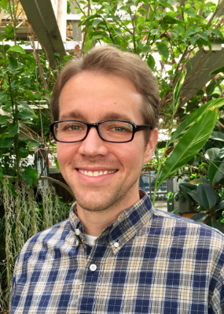
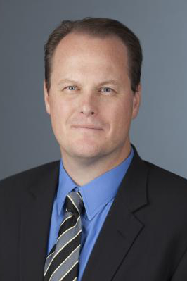

# People

   Brian J. Sanderson, Ph.D. |    Stuart J. Macdonald, Ph.D. |    Robert L. Unckless, Ph.D.
:------------------------:|:--------------------------:|:------------------------:
Lead Genomic Data Scientist   Department of Molecular   Biosciences / Center for Genomics    University of Kansas   Lawrence, KS 66045   [brian.sanderson@ku.edu](mailto:brian.sanderson@ku.edu) | Director, Genomic Data Science Core   Department of Molecular Biosciences   University of Kansas   Lawrence, KS 66045   [sjmac@ku.edu](mailto:sjmac@ku.edu)   &nbsp; &nbsp; &nbsp; &nbsp; &nbsp; &nbsp; &nbsp; &nbsp; &nbsp; &nbsp; &nbsp; &nbsp; &nbsp; &nbsp; &nbsp;&nbsp; &nbsp; &nbsp; &nbsp; &nbsp; &nbsp; &nbsp; &nbsp; &nbsp; &nbsp; &nbsp; &nbsp; &nbsp; &nbsp; &nbsp; &nbsp; &nbsp; &nbsp; &nbsp; &nbsp; &nbsp; &nbsp; &nbsp; &nbsp; &nbsp; &nbsp; &nbsp; &nbsp; &nbsp; &nbsp; &nbsp; &nbsp; |  Director, KU Center for Genomics   Department of Molecular Biosciences   University of Kansas   Lawrence, KS 66045   [unckless@ku.edu](mailto:unckless@ku.edu)   &nbsp; &nbsp; &nbsp; &nbsp; &nbsp; &nbsp; &nbsp; &nbsp; &nbsp; &nbsp; &nbsp; &nbsp; &nbsp; &nbsp; &nbsp;&nbsp; &nbsp; &nbsp; &nbsp; &nbsp; &nbsp; &nbsp; &nbsp; &nbsp; &nbsp; &nbsp; &nbsp; &nbsp; &nbsp; &nbsp; &nbsp; &nbsp; &nbsp; &nbsp; &nbsp; &nbsp; &nbsp; &nbsp; &nbsp; &nbsp; &nbsp; &nbsp; &nbsp; &nbsp; &nbsp; &nbsp; &nbsp; &nbsp; &nbsp; &nbsp;